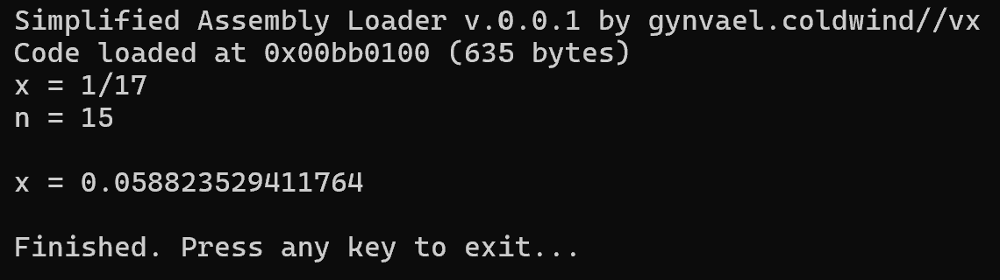
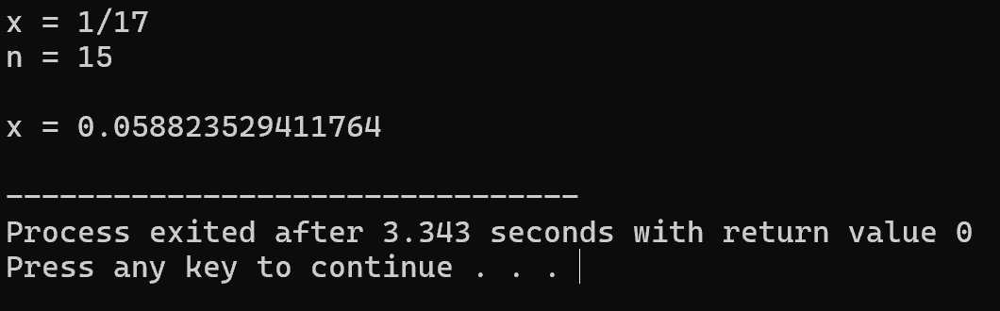
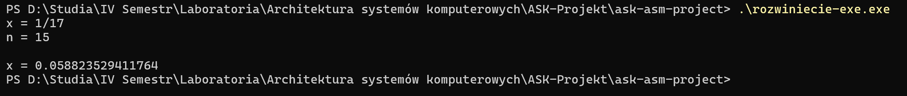

# Projekt - Architektura Systemów Komputerowych

Napisz program rozwiniecie.asm wyznaczający rozwinięcie dziesiętne ułamka zwykłego z dokładnością do n cyfr po przecinku. Przykładowa sesja:

x = 1/17
n = 15

x = 0.058823529411765(4)

### Kompilacja wersji asmloader .asm 

### Kompilacja wersji w języku programowania C

### Kompilacja wersji wykonywalnej .exe

Użyto kompilatora strawberry-perl-no64-5.32.1.1-32bit-portable

1. Przejdź do ścieżki bieżącej projektu (np wpisując powershell w pasek ścieżki w eksploratorze plików)

2. Utwórz zmienną środowiskową $env:PATH = "./strawberry\c\bin;" + $env:PAT

3. nasm -f win32 rozwiniecie-exe.asm -o rozwiniecie-exe.obj

4. gcc rozwiniecie-exe.obj -o rozwiniecie-exe.exe

5. .\rozwiniecie-exe.exe